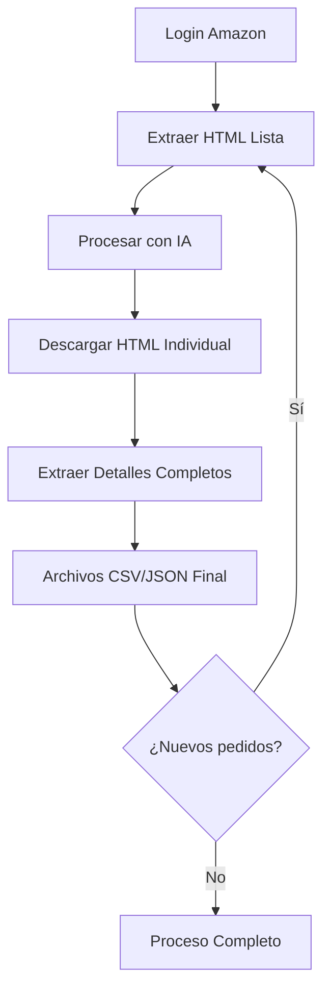

# 🛒 Amazon Pedidos - Extractor y Procesador de Datos

Un sistema automatizado para extraer, procesar y analizar datos de pedidos desde Amazon Seller Central utilizando web scraping e inteligencia artificial.

## 📋 Tabla de Contenidos

- [Características](#-características)
- [Tecnologías](#-tecnologías)
- [Prerrequisitos](#-prerrequisitos)
- [Instalación](#-instalación)
- [Uso](#-uso)
- [Estructura del Proyecto](#-estructura-del-proyecto)
- [Flujo de Trabajo](#-flujo-de-trabajo)
- [Scripts Principales](#-scripts-principales)
- [Configuración](#-configuración)
- [Solución de Problemas](#-solución-de-problemas)
- [Contribuir](#-contribuir)
- [Licencia](#-licencia)

## 🚀 Características

- **Autenticación automática** en Amazon Seller Central
- **Extracción completa** de datos de pedidos
- **Procesamiento con IA** usando modelos LLM locales (Ollama)
- **Datos estructurados** en formato JSON y CSV
- **Actualización incremental** - solo procesa pedidos nuevos
- **Información detallada** de cada pedido individual
- **Respaldos automáticos** de datos
- **Modo depuración** para troubleshooting

## 🛠 Tecnologías

- **Node.js** - Para automatización web y scraping
- **Python 3.8+** - Para procesamiento de datos e IA
- **Ollama** - Servidor LLM local
- **Puppeteer** - Automatización del navegador
- **BeautifulSoup4** - Parsing de HTML
- **OpenAI API** - Interfaz para LLMs

## 📋 Prerrequisitos

### Software requerido:
1. **Node.js** (v14 o superior)
2. **Python 3.8+**
3. **Ollama** con modelo `llama3.1:8b`

### Cuentas necesarias:
- Cuenta de vendedor activa en Amazon Seller Central

## 🔧 Instalación

1. **Clonar el repositorio:**
   ```bash
   git clone https://github.com/tu-usuario/amazon-pedidos.git
   cd amazon-pedidos
   ```

2. **Instalar dependencias de Node.js:**
   ```bash
   npm install
   ```

3. **Instalar dependencias de Python:**
   ```bash
   pip install openai pathlib beautifulsoup4
   ```

4. **Configurar Ollama:**
   ```bash
   # Instalar Ollama (si no está instalado)
   # Descargar el modelo requerido
   ollama pull llama3.1:8b
   
   # Verificar que esté ejecutándose
   ollama serve
   ```

5. **Crear estructura de carpetas:**
   ```bash
   mkdir cookies html html_pedidos csv csv/backup
   ```

## 🎯 Uso

### Flujo completo de 5 pasos:

#### **Paso 1: Autenticación** 🔐
```bash
node scripts/login_amazon.js
```
- Abre navegador para login manual
- Guarda cookies de sesión

#### **Paso 2: Extracción de HTML** 📄
```bash
node scripts/extraer_html_tabla.js
```
- Descarga página de lista de pedidos
- Genera archivo HTML con fecha

#### **Paso 3: Procesamiento con IA** 🤖
```bash
python scripts/parser_tabla_llm.py
```
- Extrae datos estructurados con IA
- Genera archivos JSON y CSV consolidados

#### **Paso 4: Descarga Individual** 📥
```bash
node scripts/extraer_detalles_pedidos.js
```
- Descarga HTML de cada pedido individual
- Identifica pedidos pendientes automáticamente

#### **Paso 5: Extracción de Detalles** 🧠
```bash
python scripts/parser_detalles_llm.py
```
- Extrae información completa de cada pedido
- Actualiza archivos con datos detallados

## 📁 Estructura del Proyecto

```
amazon_pedidos/
├── scripts/                  # Scripts de automatización
│   ├── login_amazon.js      # Autenticación
│   ├── extraer_html_tabla.js # Extracción de lista
│   ├── extraer_detalles_pedidos.js # Descarga individual
│   ├── parser_tabla_llm.py  # Procesamiento principal
│   ├── parser_detalles_llm.py # Extracción de detalles
│   └── debug_*.py           # Herramientas de depuración
├── cookies/                 # Sesiones guardadas (Git ignored)
├── html/                    # HTML de páginas (Git ignored)
├── html_pedidos/           # HTML individual (Git ignored)
├── csv/                    # Datos procesados (Git ignored)
│   └── backup/             # Respaldos automáticos
├── package.json            # Dependencias Node.js
├── instrucciones.md        # Documentación detallada
├── .gitignore             # Archivos excluidos
└── README.md              # Este archivo
```

## 🔄 Flujo de Trabajo



## 📊 Datos Extraídos

### Información básica:
- ID de pedido
- Fecha de pedido
- Nombre del producto
- ASIN y SKU
- Cantidad y subtotal
- Estado del pedido
- Fecha límite de envío

### Información detallada:
- Dirección completa de envío
- Teléfono del comprador
- Costos de envío
- Impuestos aplicados
- Total del pedido

## ⚙️ Configuración

### Configuración de Ollama:
```python
# En los scripts de Python
LLM = "llama3.1:8b"
client = OpenAI(base_url="http://localhost:11434/v1", api_key="ollama")
```

### URL de Amazon:
```javascript
// En extraer_html_tabla.js
const URL_PEDIDOS = 'https://sellercentral.amazon.com/orders-v3/mfn/unshipped/?page=1';
```

### Modo depuración:
```python
# En scripts de Python
MODO_DEPURACION = True  # Para ver output detallado
```

## 🐛 Solución de Problemas

### **Error: "No se encuentra session.json"**
```bash
# Solución: Ejecutar primero login
node scripts/login_amazon.js
```

### **Error: "Archivo HTML no encontrado"**
```bash
# Verificar que el paso anterior se ejecutó correctamente
ls html/
```

### **Error: "Conexión a Ollama fallida"**
```bash
# Verificar que Ollama esté ejecutándose
ollama serve
curl http://localhost:11434/api/tags
```

### **Error: "Sesión expirada"**
```bash
# Re-ejecutar login para renovar cookies
node scripts/login_amazon.js
```

## 📈 Características Avanzadas

- **Actualización incremental**: Solo procesa pedidos nuevos
- **Respaldos automáticos**: Versiones anteriores se guardan automáticamente
- **Pausas inteligentes**: Evita sobrecargar servidores de Amazon
- **Manejo de errores**: Logs detallados para troubleshooting
- **Formato de datos**: Compatible con Excel y herramientas de análisis

## 🤝 Contribuir

1. Fork el proyecto
2. Crear una rama de feature (`git checkout -b feature/AmazingFeature`)
3. Commit tus cambios (`git commit -m 'Add some AmazingFeature'`)
4. Push a la rama (`git push origin feature/AmazingFeature`)
5. Abrir un Pull Request

## ⚠️ Consideraciones Importantes

- **Términos de servicio**: Asegúrate de cumplir con los términos de Amazon
- **Límites de velocidad**: El sistema incluye pausas para evitar bloqueos
- **Datos privados**: Nunca subas datos reales de pedidos a repositorios públicos
- **Backup regular**: Mantén copias de seguridad de tus datos importantes

## 📄 Licencia

Este proyecto está bajo la Licencia MIT - ver el archivo [LICENSE](LICENSE) para detalles.

## 🙏 Agradecimientos

- [Ollama](https://ollama.ai/) por el servidor LLM local
- [Puppeteer](https://pptr.dev/) por la automatización web
- [BeautifulSoup](https://www.crummy.com/software/BeautifulSoup/) por el parsing HTML

---

## 📞 Soporte

Si encuentras algún problema o tienes preguntas:

1. Revisa la [documentación detallada](instrucciones.md)
2. Busca en los [Issues existentes](https://github.com/tu-usuario/amazon-pedidos/issues)
3. Crea un [nuevo Issue](https://github.com/tu-usuario/amazon-pedidos/issues/new) si es necesario

---

**⚡ ¡Automatiza tu gestión de pedidos de Amazon con IA!** ⚡