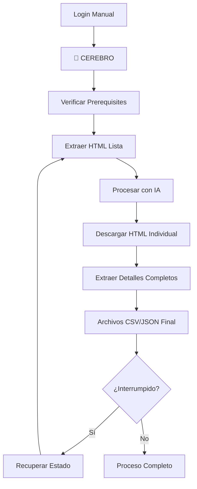
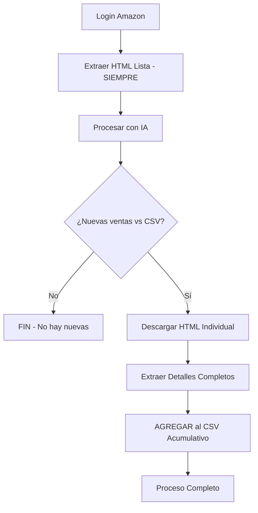

# 🛒 Amazon Pedidos - Extractor y Procesador de Datos

Un sistema automatizado para extraer, procesar y analizar datos de pedidos desde Amazon Seller Central utilizando web scraping e inteligencia artificial.

## 📋 Tabla de Contenidos

- [Características](#-c### Características del CEREBRO:

- **🔒 Login Seguro**: No automatiza autenticación, te guía paso a paso
- **🔄 Ejecución Inteligente**: Ejecuta solo lo necesario sin intervención  
- **💾 Sistema de Estados**: Recupera desde interrupciones automáticamente
- **🎨 Logging Detallado**: Output con colores y timestamps en tiempo real
- **✅ Verificaciones**: Valida prerrequisitos antes de cada paso
- **⚡ Detección Inteligente**: Solo procesa pedidos nuevos vs CSV existente
- **🛡️ Manejo de Errores**: Mensajes claros y recuperación automática
- **💾 Backup Automático**: Crea respaldos con timestamp después de cada ejecución
- **🔄 Auto-Reset**: Se limpia automáticamente para próximas ejecucionessticas)
- [Tecnologías](#-tecnologías)
- [Prerrequisitos](#-prerrequisitos)
- [Instalación](#-instalación)
- [Uso](#-uso)
- [Estructura del Proyecto](#-estructura-del-proyecto)
- [Flujo de Trabajo](#-flujo-de-trabajo)
- [Scripts Principales](#-scripts-principales)
- [Configuración](#-configuración)
- [Solución de Problemas](#-solución-de-problemas)
- [Contribuir](#-contribuir)
- [Licencia](#-licencia)

## 🚀 Características

- **Autenticación automática** en Amazon Seller Central
- **Extracción completa** de datos de pedidos
- **Procesamiento con IA** usando modelos LLM locales (Ollama)
- **Datos estructurados** en formato JSON y CSV
- **Actualización incremental** - solo procesa pedidos nuevos
- **Información detallada** de cada pedido individual
- **Respaldos automáticos** de datos
- **Modo depuración** para troubleshooting

## 🛠 Tecnologías

- **Node.js** - Para automatización web y scraping
- **Python 3.8+** - Para procesamiento de datos e IA
- **Ollama** - Servidor LLM local
- **Puppeteer** - Automatización del navegador
- **BeautifulSoup4** - Parsing de HTML
- **OpenAI API** - Interfaz para LLMs

## 📋 Prerrequisitos

### Software requerido:
1. **Node.js** (v14 o superior)
2. **Python 3.8+**
3. **Ollama** con modelo `llama3.1:8b`

### Cuentas necesarias:
- Cuenta de vendedor activa en Amazon Seller Central

## 🔧 Instalación

1. **Clonar el repositorio:**
   ```bash
   git clone https://github.com/tu-usuario/amazon-pedidos.git
   cd amazon-pedidos
   ```

2. **Instalar dependencias de Node.js:**
   ```bash
   npm install
   ```

3. **Instalar dependencias de Python:**
   ```bash
   pip install openai pathlib beautifulsoup4 colorama
   ```

4. **Configurar Ollama:**
   ```bash
   # Instalar Ollama (si no está instalado)
   # Descargar el modelo requerido
   ollama pull llama3.1:8b
   
   # Verificar que esté ejecutándose
   ollama serve
   ```

5. **Crear estructura de carpetas:**
   ```bash
   mkdir cookies html html_pedidos csv csv/backup
   ```

## 🎯 Uso

### 🧠 Ejecución Automática con CEREBRO (Recomendado):

El proyecto incluye un **script maestro** que automatiza todo el flujo:

```bash
# 1. Ejecutar login manual (único paso manual)
node scripts/login_amazon.js

# 2. Ejecutar el cerebro que hace todo automáticamente
python cerebro.py
```

El **CEREBRO** se encarga de:
- ✅ Verificar prerrequisitos automáticamente
- ✅ Ejecutar todos los pasos en secuencia
- ✅ Manejar errores y recuperación
- ✅ Mostrar progreso detallado
- ✅ Recuperar desde interrupciones

### 📋 Ejecución Manual Paso a Paso:

Si prefieres control manual, puedes ejecutar cada paso individualmente:

#### **Paso 1: Autenticación** 🔐
```bash
node scripts/login_amazon.js
```
- Abre navegador para login manual
- Guarda cookies de sesión

#### **Paso 2: Extracción de HTML** 📄
```bash
node scripts/extraer_html_tabla.js
```
- Descarga página de lista de pedidos
- Genera archivo HTML con fecha

#### **Paso 3: Procesamiento con IA** 🤖
```bash
python scripts/parser_tabla_llm.py
```
- Extrae datos estructurados con IA
- Genera archivos JSON y CSV consolidados

#### **Paso 4: Descarga Individual** 📥
```bash
node scripts/extraer_detalles_pedidos.js
```
- Descarga HTML de cada pedido individual
- Identifica pedidos pendientes automáticamente

#### **Paso 5: Extracción de Detalles** 🧠
```bash
python scripts/parser_detalles_llm.py
```
- Extrae información completa de cada pedido
- Actualiza archivos con datos detallados

## 📁 Estructura del Proyecto

```
amazon_pedidos/
├── scripts/                  # Scripts de automatización
│   ├── login_amazon.js      # Autenticación
│   ├── extraer_html_tabla.js # Extracción de lista
│   ├── extraer_detalles_pedidos.js # Descarga individual
│   ├── parser_tabla_llm.py  # Procesamiento principal
│   ├── parser_detalles_llm.py # Extracción de detalles
│   └── debug_*.py           # Herramientas de depuración
├── cerebro.py               # 🧠 SCRIPT MAESTRO - Automatización completa
├── cerebro_estado.json      # Estado del sistema (auto-generado)
├── cookies/                 # Sesiones guardadas (Git ignored)
├── html/                    # HTML de páginas (Git ignored)
├── html_pedidos/           # HTML individual (Git ignored)
├── csv/                    # Datos procesados (Git ignored)
│   └── backup/             # Respaldos automáticos
├── package.json            # Dependencias Node.js
├── instrucciones.md        # Documentación detallada
├── .gitignore             # Archivos excluidos
└── README.md              # Este archivo
```

## 🗄️ Sincronización con Base de Datos Central (CAPALSA)

Después de cada corrida del robot, los nuevos pedidos se suben al PostgreSQL en Tecnómata Node-1.

### Flujo completo de una corrida semanal:

```
1. node scripts/login_amazon.js   ← login manual (cookies ~6h)
2. python cerebro.py              ← extrae y actualiza pedidos_consolidados.csv
3. node upsert-to-db.js           ← sube solo los registros nuevos a la BD
```

### ¿Cómo funciona el upsert?

- Lee `csv/pedidos_consolidados.csv` completo
- Por cada fila, intenta insertar en la tabla `ventas` usando `id_pedido` como clave única
- Si el pedido ya existe → lo ignora (`ON CONFLICT DO NOTHING`)
- Si es nuevo → lo inserta
- Al final imprime: `Insertados: X | Ya existían: Y | Total CSV: Z`

### Conexión

- **Host:** 192.168.1.175 (Tecnómata Node-1 — red local)
- **Puerto:** 5432
- **BD:** capalsa
- **Tabla:** ventas

### Verificar qué hay en la BD

```bash
# SSH al servidor
ssh arturo@192.168.1.175

# Consulta rápida
docker exec capalsa-postgres psql -U capalsa -d capalsa -c \
  "SELECT COUNT(*) as total, MAX(fecha_pedido) as ultima_venta FROM ventas;"
```

---

## 🔄 Flujo de Trabajo

### Con CEREBRO (Automatizado):

```mermaid
graph TD
    A[Login Manual] --> B[🧠 CEREBRO]
    B --> C[Verificar Prerequisites]
    C --> D[Extraer HTML Lista]
    D --> E[Procesar con IA]
    E --> F[Descargar HTML Individual]
    F --> G[Extraer Detalles Completos]
    G --> H[Archivos CSV/JSON Final]
    
    H --> I{¿Interrumpido?}
    I -->|Sí| J[Recuperar Estado]
    J --> D
    I -->|No| K[Proceso Completo]
```

### Manual (Paso a Paso):

```mermaid
graph TD
    A[Login Amazon] --> B[Extraer HTML Lista - SIEMPRE]
    B --> C[Procesar con IA]
    C --> D{¿Nuevas ventas vs CSV?}
    D -->|No| E[FIN - No hay nuevas]
    D -->|Sí| F[Descargar HTML Individual]
    F --> G[Extraer Detalles Completos]
    G --> H[AGREGAR al CSV Acumulativo]
    H --> I[Proceso Completo]
```

## 📊 Datos Extraídos

### Información básica:
- ID de pedido
- Fecha de pedido
- Nombre del producto
- ASIN y SKU
- Cantidad y subtotal
- Estado del pedido
- Fecha límite de envío

### Información detallada:
- Dirección completa de envío
- Teléfono del comprador
- Costos de envío
- Impuestos aplicados
- Total del pedido

## ⚙️ Configuración

### Configuración de Ollama:
```python
# En los scripts de Python
LLM = "llama3.1:8b"
client = OpenAI(base_url="http://localhost:11434/v1", api_key="ollama")
```

### URL de Amazon:
```javascript
// En extraer_html_tabla.js
const URL_PEDIDOS = 'https://sellercentral.amazon.com/orders-v3/mfn/unshipped/?page=1';
```

### Modo depuración:
```python
# En scripts de Python
MODO_DEPURACION = True  # Para ver output detallado
```

## 🐛 Solución de Problemas

### **Error: "No se encuentra session.json"**
```bash
# Solución: Ejecutar primero login
node scripts/login_amazon.js
```

### **Error: "Archivo HTML no encontrado"**
```bash
# Verificar que el paso anterior se ejecutó correctamente
ls html/
```

### **Error: "Conexión a Ollama fallida"**
```bash
# Verificar que Ollama esté ejecutándose
ollama serve
curl http://localhost:11434/api/tags
```

### **Error: "Sesión expirada"**
```bash
# Re-ejecutar login para renovar cookies
node scripts/login_amazon.js
```

## 🧠 CEREBRO - Script Maestro

### Características del CEREBRO:

- **🔄 Ejecución Automática**: Ejecuta todo el flujo sin intervención
- **💾 Sistema de Estados**: Recupera desde interrupciones automáticamente
- **🎨 Logging Detallado**: Output con colores y timestamps
- **✅ Verificaciones**: Valida prerrequisitos antes de cada paso
- **⚡ Recuperación Inteligente**: Salta pasos ya completados
- **�️ Manejo de Errores**: Mensajes claros y recuperación automática

### Comandos del CEREBRO:

```bash
# Ejecución completa
python cerebro.py

# Ver estado actual
python cerebro.py --status

# Reiniciar estado
python cerebro.py --reset

# Mostrar ayuda
python cerebro.py --help
```

## �📈 Características Avanzadas

- **Actualización incremental**: Solo procesa pedidos nuevos
- **Respaldos automáticos**: Versiones anteriores se guardan automáticamente
- **Pausas inteligentes**: Evita sobrecargar servidores de Amazon
- **Manejo de errores**: Logs detallados para troubleshooting
- **Formato de datos**: Compatible con Excel y herramientas de análisis
- **Recuperación de estado**: Continúa desde donde se interrumpió

## 📚 Documentación Completa

- **cerebro.py** - Script maestro automatizado (⭐ **RECOMENDADO** ⭐)
- **instrucciones.md** - Guía paso a paso detallada (manual)
- **README.md** - Este archivo (documentación general)

### 🚀 Inicio Rápido con CEREBRO

```bash
# Ejecutar proceso completo automatizado
python cerebro.py
```

**🔍 Flujo automático inteligente:**
1. **Login Manual**: CEREBRO te pide hacer login en otra terminal, espera tu confirmación
2. **Extracción HTML**: Siempre descarga HTML fresco para detectar nuevas ventas
3. **Procesamiento IA**: Compara con CSV existente, detecta solo pedidos nuevos
4. **Descarga Individual**: Solo si hay nuevos, descarga HTML de cada pedido nuevo
5. **Extracción Detalles**: Agrega detalles completos al CSV consolidado (acumulativo)
6. **Backup Automático**: Crea respaldo con timestamp automáticamente
7. **Reset Estado**: Se limpia automáticamente para próxima ejecución

**🔒 Seguridad del Login:**
- CEREBRO NO ejecuta el login automáticamente por seguridad
- Te da instrucciones claras para ejecutar en otra terminal
- Espera tu confirmación antes de continuar
- Verifica cookies antes de proceder

### 📖 Para Usuarios Avanzados

Si prefieres control total o necesitas debugging, consulta `instrucciones.md` para el flujo manual paso a paso.

### 🔄 CSV Acumulativo

El archivo `pedidos_consolidados.csv` es **acumulativo** - nunca se borra, solo se agregan nuevas ventas. Perfecto para análisis histórico completo.

## 🤝 Contribuir

1. Fork el proyecto
2. Crear una rama de feature (`git checkout -b feature/AmazingFeature`)
3. Commit tus cambios (`git commit -m 'Add some AmazingFeature'`)
4. Push a la rama (`git push origin feature/AmazingFeature`)
5. Abrir un Pull Request

## ⚠️ Consideraciones Importantes

- **Términos de servicio**: Asegúrate de cumplir con los términos de Amazon
- **Límites de velocidad**: El sistema incluye pausas para evitar bloqueos
- **Datos privados**: Nunca subas datos reales de pedidos a repositorios públicos
- **Backup regular**: Mantén copias de seguridad de tus datos importantes

## 📄 Licencia

Este proyecto está bajo la Licencia MIT - ver el archivo [LICENSE](LICENSE) para detalles.

## 🙏 Agradecimientos

- [Ollama](https://ollama.ai/) por el servidor LLM local
- [Puppeteer](https://pptr.dev/) por la automatización web
- [BeautifulSoup](https://www.crummy.com/software/BeautifulSoup/) por el parsing HTML

---

## 📞 Soporte

Si encuentras algún problema o tienes preguntas:

1. Revisa la [documentación detallada](instrucciones.md)
2. Busca en los [Issues existentes](https://github.com/tu-usuario/amazon-pedidos/issues)
3. Crea un [nuevo Issue](https://github.com/tu-usuario/amazon-pedidos/issues/new) si es necesario

---

**⚡ ¡Automatiza tu gestión de pedidos de Amazon con IA!** ⚡